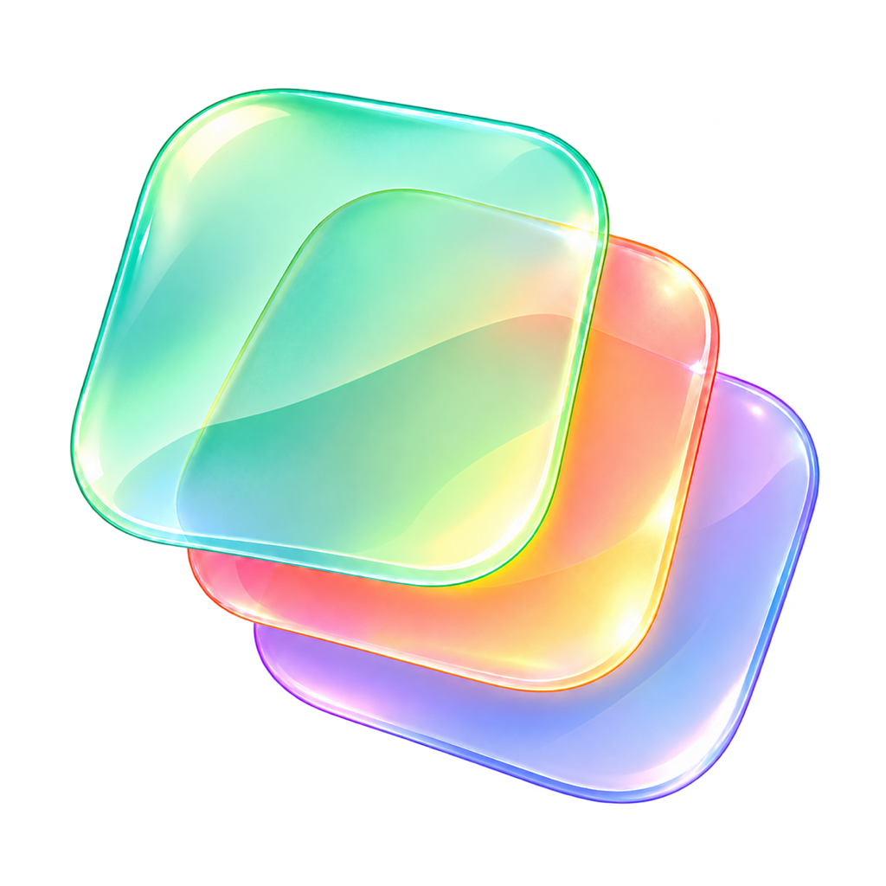

# 叠绘 / Compositor



**为 Compositor 做中文版，并持续修复、完善图像编辑体验。**

本项目基于 **[Robbie Tilton](https://github.com/robbietilton)** 的 **[Compositor](https://github.com/robbietilton/Compositor)**，参考和借鉴 **[Terry Jia / jtydhr88](https://github.com/jtydhr88)** 的 **[Pentrado](https://github.com/jtydhr88/pentrado)**。感谢两位作者及各自项目的贡献者开放源码，让中文本地化与后续完善成为可能。

这是社区维护的中文完善版。原生 macOS 应用与基础编辑能力来自 Compositor；Pentrado 为功能规划、编辑操作设计及对齐/分布算法提供参考。我们希望改进成果也能帮助原项目。

**Chinese localization and ongoing improvements for Compositor.**

Built on **[Compositor](https://github.com/robbietilton/Compositor)** by **[Robbie Tilton](https://github.com/robbietilton)**, with ideas and adapted alignment/distribution geometry from **[Pentrado](https://github.com/jtydhr88/pentrado)** by **[Terry Jia / jtydhr88](https://github.com/jtydhr88)**. Thank you to both authors and their contributors for sharing their work. This community edition focuses on a Chinese interface, fixes, and practical improvements, with the hope that useful changes can benefit the upstream projects too.

## 下载与使用 / Download and use

### Windows 10 / 11

- **[Windows 下载 / Windows downloads](https://github.com/Pengjingyu1992/Compositor-ZH/releases/tag/windows-v0.3.0-alpha.1)** · **[安装说明 / Installation guide](docs/windows-install.md)** · **[工具与快捷键 / Tools and shortcuts](docs/windows-full-editor.md)**
- Windows 10 22H2 / Windows 11，x64。0.3.0 编辑器提供 17 类工具：选区、裁剪、中文文字、可编辑形状、绘画/蒙版、渐变/油漆桶、仿制/修复/涂抹、取色与导航；另有多层变换、对齐/分布、编组/合并、21 项滤镜、调整/效果、剪贴板、撤销、保存、恢复和 PSD/PNG 转换，中英文即时切换。 / Windows 10 22H2 / Windows 11, x64. The 0.3.0 editor provides 17 tools for selections, crop, Chinese text, editable shapes, painting/masks, gradients/fill, clone/healing/smear, eyedropper and navigation, plus multi-layer transforms, arrangement, groups/merge, 21 filters, adjustments/effects, clipboard, undo, saving, recovery, PSD/PNG conversion, and Chinese/English switching.
- 基于 Pentrado 引擎，提供 EXE 安装包和便携 ZIP，无需 Node.js 或 API Key。 / Built with the Pentrado engine; available as an EXE installer or portable ZIP. No Node.js or API key is required.

### macOS

- [下载最新版本 / Download the latest release](https://github.com/Pengjingyu1992/Compositor-ZH/releases/latest)
- **macOS 26 或更高版本，Apple Silicon。 / macOS 26 or later, Apple silicon.**
- 解压后将 `Compositor.app` 拖到“应用程序”目录。 / Unzip and drag `Compositor.app` into Applications.
- 安装包直接使用，无需编译或安装开发工具。 / Use the downloaded app directly; no compilation or developer tools are needed.
- **叠绘 → 设置… → 界面语言**：选择简体中文或 English，保存项目后退出并重新打开应用。选择会保留；中文应用名为“叠绘”，英文为“Compositor”。
- **Compositor → Settings… → Interface language**: choose Simplified Chinese or English, save your work, then quit and reopen. Your choice persists.

当前安装包采用临时签名，未经 Apple Developer ID 公证；macOS 可能要求在“隐私与安全性”中确认打开。 / The current package is ad hoc signed and is not Apple notarized; macOS may require approval in Privacy & Security.

## 本版改进 / Changes in this edition

| 功能 / Feature | 说明 / Notes |
| --- | --- |
| 中文与英文 / Chinese and English | 界面、菜单、提示、撤销名称与语言设置；下次启动切换。 / Localized UI, menus, alerts, undo names, and a persistent language setting applied on restart. |
| 宽高互换 / Swap dimensions | 新建画布时交换宽度和高度。 / Swap width and height when creating a canvas. |
| 对齐与分布 / Align and distribute | 6 种对齐、4 种分布；参照选中对象、画布或关键图层。 / Six alignment and four distribution operations, relative to the selection, canvas, or a key layer. |
| 油漆桶 / Paint bucket | `K`；颜色容差、连续区域及采样全部图层，结合当前选区。 / `K`; tolerance, contiguous filling, sample-all-layers, and current-selection coverage. |
| 马赛克 / Mosaic | 1–512 像素色块，支持预览、透明度、选区及撤销。 / 1–512 px blocks, preview, transparency, selections, and undo. |
| 本地恢复副本 / Local recovery | 编辑后延迟写入恢复副本；恢复为独立未保存草稿。 / Delayed recovery snapshots after edits, restored as separate unsaved drafts. |
| PSD 导出 / PSD export | 8 位 RGB，分层或合成导出；像素层、组、混合、不透明度、蒙版。 / 8-bit RGB layered or flattened export, with pixels, groups, blending, opacity, and masks. |
| 稳定性 / Reliability | 编辑许可与异步提交检查；修复尺寸调整时效果丢失等问题。 / Edit permissions, guarded asynchronous commits, and fixes including effects preservation during resizing. |
| 新图标 / New icon | 薄荷绿、珊瑚粉、柔黄与淡紫的叠层图标。 / A layered icon in mint, coral, soft yellow, and lavender. |

基础图层、蒙版、画笔、文字、形状、选区、调整层、Camera Raw、PSD 导入及多项目标签等能力来自 Compositor。

Core layers, masks, brushes, text, shapes, selections, adjustments, Camera Raw, PSD import, and project tabs come from Compositor.

### 当前边界 / Current limits

- PSD 分层导出将文字和形状栅格化；调整层、图层效果及不支持的剪贴关系需要合成导出。详见 [PSD 导出说明](docs/psd-export.md)。 / Text and shapes are rasterized; adjustments, effects, and unsupported clipping relationships require flattened export.
- 恢复副本延迟 2 秒写入，最后的改动可能尚未落盘。详见 [恢复说明](docs/recovery.md)。 / Recovery writes are delayed by two seconds; the latest edits may not have reached disk.
- 更新菜单打开本仓库的下载页，手动安装新版本。 / The update command opens this edition's releases for manual installation.
- macOS 版尚未实现图层锁定和对称画笔；Windows 版提供会话锁定和对称绘画。任意矢量路径持久化仍未实现。 / Layer locks and symmetric painting are pending on macOS; Windows provides session locks and symmetry. Persistent arbitrary vector paths remain unimplemented.

## 构建 / Build

Windows 构建与云端验证见 [Windows 安装和开发说明](docs/windows-install.md)。macOS 构建保持以下流程。 / For Windows builds and cloud checks, see [Windows installation and development](docs/windows-install.md).

### Command Line Tools

使用带 macOS 26 SDK 的 Command Line Tools，可独立构建完整应用。macOS 27 的独立 CLT SDK 可能缺少 SwiftUI 宏插件，脚本优先选择已安装的 macOS 26 SDK；可用 `COMPOSITOR_SDK_PATH` 指定 SDK。

Command Line Tools with a macOS 26 SDK can build the app. The standalone macOS 27 SDK may lack SwiftUI macro plugins, so the script prefers an installed macOS 26 SDK. Override it with `COMPOSITOR_SDK_PATH` if needed.

```sh
./scripts/check-localization.zsh
./scripts/build-clt.zsh
./scripts/package.zsh
```

输出：`build/clt/Compositor.app`、`dist/` 中的 ZIP 和 SHA-256。 / Outputs: `build/clt/Compositor.app`, plus a ZIP and SHA-256 checksum in `dist/`.

## 来源、致谢与许可 / Credits and license

- **Compositor — Robbie Tilton / Wonder Assembly LLC**: the upstream native editor and most of this codebase. **MIT**, with the original copyright and license retained in [LICENSE](LICENSE).
- **Pentrado — Terry Jia / jtydhr88**: editing architecture and feature references, plus alignment/distribution geometry adapted to Swift. **MIT** notice retained in [Pentrado-LICENSE.txt](Compositor/Resources/Pentrado-LICENSE.txt).
- 本仓库的中文本地化及改动同样以 MIT 许可发布。 / Localization and modifications in this repository are also released under MIT.

详见 [第三方说明 / Third-party notices](THIRD_PARTY_NOTICES.md)、[源码来源 / Source provenance](UPSTREAM.md) 与 [发布审查 / Release review](docs/release-audit.md)。
